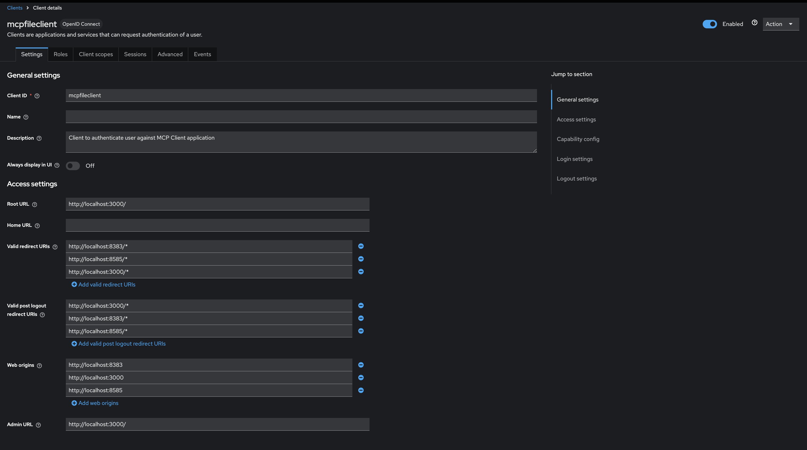
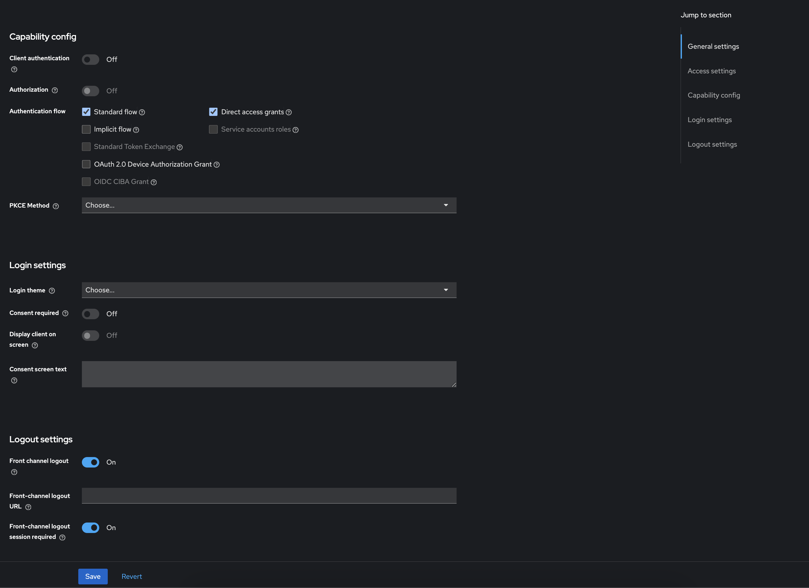
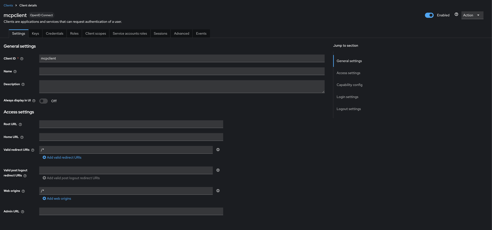

# 🔑 Keycloak Configuration Guide for File Assistant

## Overview
Keycloak is used for authentication and authorization in the File Assistant MCP Server and Client. This document outlines the necessary configuration steps and account setup.

The real name configred in Keycloak for this project is "home".
## Client Configuration

### MCP File Client (`mcpfileclient`)

#### JWT Token Validation
This client is used for JWT token validation and client application authentication.

#### URL Configuration
Configure the following settings according to your File Assistant MCP Client application:
- **Valid Redirect URIs**: Add your application's URLs
- **Web Origins**: Configure allowed origins

> **Note**: In this example, we've configured multiple ports (3000, 8383, and 8585) for development purposes.

### MCP Client (`mcpclient`)
This client is used to obtain MCP Server details during client startup.

## User Management

### Roles and Access
Configure the following user roles for MCP Client access:
- **Admin**: Full access to all MCP Server features
- **User**: Standard user access with limited permissions
- **Read-Only**: View-only access to MCP Server resources

## Best Practices
- Always use HTTPS in production environments
- Regularly rotate client secrets
- Implement proper role-based access control
- Monitor and audit authentication logs

## Troubleshooting
- If experiencing authentication issues, verify:
  - Client configuration in Keycloak
  - Redirect URIs match exactly
  - User roles are properly assigned
  - Client secrets are correctly configured

- Users with roles to login at MCP Client to access MCP Server